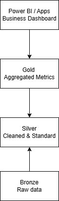

# ms-fabric-hospital-analytics-medallion-project
“Interactive end-to-end MS Fabric Hospitality Analytics Medallion project: ingest, clean, aggregate data, and visualise business KPIs in Power BI.”

# Overview

**Business Problem**

Retail locations struggle to monitor daily operational efficiency because sales revenue, labour costs, and inventory usage are tracked in separate systems, making it difficult to quickly understand profitability and make data-driven decisions.

**Why it matters:**

- Managers cannot easily identify locations with high labour costs relative to revenue.
- Inefficiencies like waste, stock-outs, or overstaffing reduce overall profitability.
- Timely, aggregated insights help optimise staffing, control costs, and maximise profit margins.
- Provides a single source of truth for reporting, enabling faster and more confident decisions.

# Architecture

 
# Tech Stack 
- Microsoft Fabric
- PySpark
- Power BI

# Medallion Design Explain Bronze / Silver / Gold clearly
