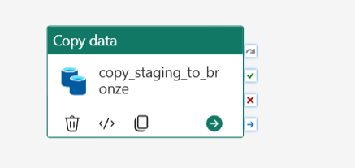
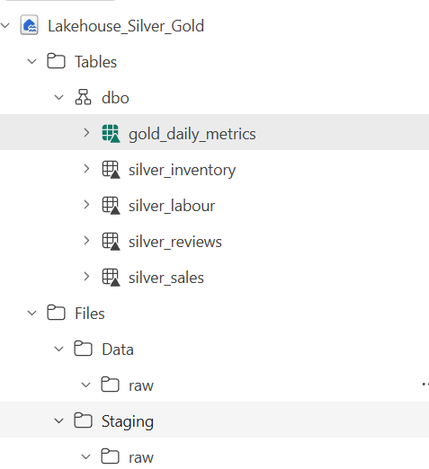
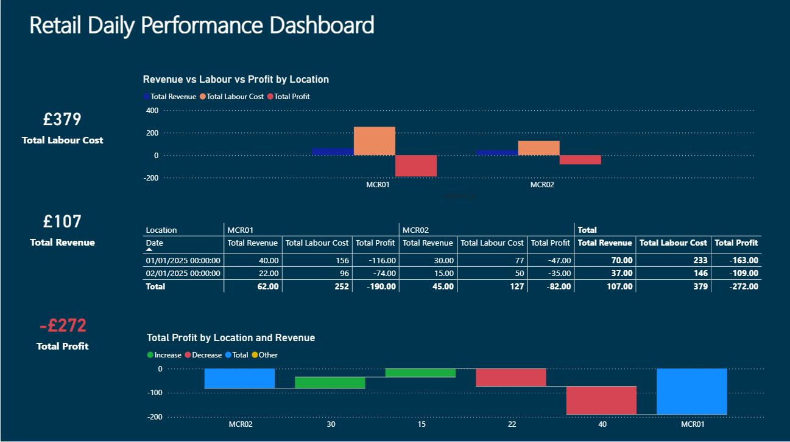

# ms-fabric-hospital-analytics-medallion-project
“Interactive end-to-end MS Fabric Hospitality Analytics Medallion project: ingest, clean, aggregate data, and visualise business KPIs in Power BI.”

# Overview

**Business Problem**

Retail locations struggle to monitor daily operational efficiency because sales revenue, labour costs, and inventory usage are tracked in separate systems, making it difficult to quickly understand profitability and make data-driven decisions.

**Why it matters:**

- Managers cannot easily identify locations with high labour costs relative to revenue.
- Inefficiencies like waste, stock-outs, or overstaffing reduce overall profitability.
- Timely, aggregated insights help optimise staffing, control costs, and maximise profit margins.
- Provides a single source of truth for reporting, enabling faster and more confident decisions.

# Architecture


# Tech Stack

| Component | Purpose |
|-----------|---------|
| Microsoft Fabric (OneLake, Lakehouse, Pipelines) | Data ingestion, storage, transformation, orchestration |
| PySpark | Data processing and transformations |
| Power BI | Visualisation of Gold layer metrics |
| CSV / Text Files | Source datasets: sales, labour, inventory, reviews |

# Medallion Design

**Bronze Layer (Raw Data):** Preserves original CSVs, minimal changes.  
**Silver Layer (Cleaned / Standardized):** Remove duplicates, fix nulls, standardise types.  
**Gold Layer (Aggregated Metrics):** Business-ready table for dashboards (`total_revenue`, `total_labour_cost`, `profit`).  

**Flow:**  
`Bronze → Silver → Gold → Power BI Dashboards`

# Key Insights

- **Labour Cost % vs Revenue** – Identifies high labour cost locations/days.  
- **Profitability Analysis** – Monitors negative profits and underperforming locations.  
- **Waste & Inventory Impact** – Connects stock usage to margin impact.  
- **Daily Performance Monitoring** – Tracks revenue, labour, and profit per location/day.  

# Screenshots

**Pipelines:** Bronze ingestion pipeline from OneLake → Bronze tables.  



**Lakehouse:** Tables for Bronze, Silver, Gold with schema and sample data.  



**Dashboard:** Power BI report with KPI Cards, Matrix, Column and Waterfall charts.  



# Project Structure

```ms-fabric-medallion-project/
│
├─ README.md
│
├─ datasets/ Raw input files
│ ├─ sales.csv
│ ├─ labour.csv
│ ├─ reviews.csv
│ └─ inventory.csv
│
├─ pipelines/ Data ingestion (Bronze layer)
│ └─ bronze_pipeline.json
│
├─ notebooks/ Data transformations
│ ├─ silver_transforms.ipynb
│ └─ gold_aggregation.ipynb
│
├─ reports/ Power BI dashboard
│ └─ powerbi/
│ └─ gold_metrics.pbix
│
└─ images/ Architecture diagram
└─ architecture.png
```

# Steps to Reproduce

1. Upload CSV files from `/datasets` into OneLake staging (Files section of Lakehouse)

2. Run Bronze ingestion:
   - Run Fabric pipeline
   - Output: Bronze tables (`bronze_sales`, `bronze_labour`, `bronze_reviews`, `bronze_inventory`)

3. Run Silver transformations:
   - Execute `silver_transforms.ipynb`
   - Cleans data (removes duplicates, filters invalid values)

4. Run Gold aggregation:
   - Execute `gold_aggregation.ipynb`
   - Output table: `gold_daily_metrics`

5. Open Power BI report:
   - Load `gold_metrics.pbix`
   - Connect to `gold_daily_metrics`
   - View dashboard visuals
